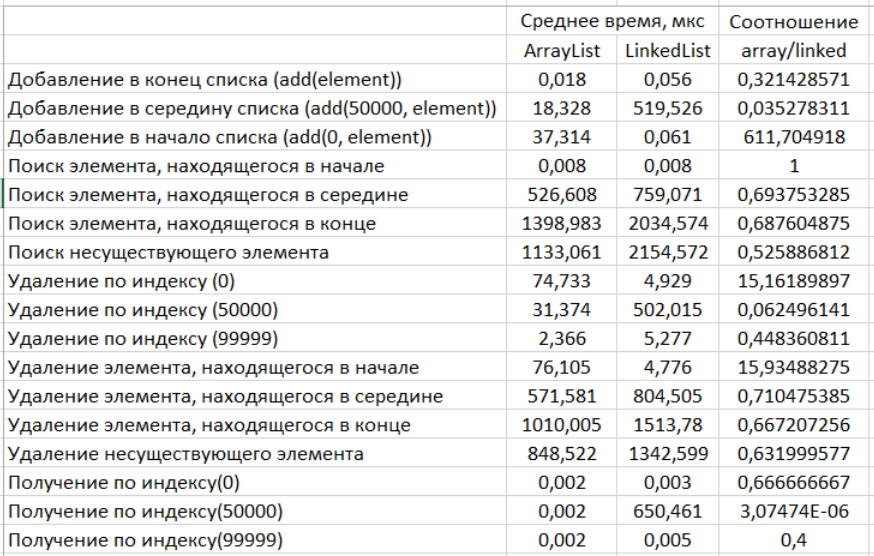

Выполнение с текущими настройками займёт около 6 минут (на моём древнем железе с текущими настройками тестов так).

Время на итерацию ограничил 100 мс, иначе на тестах на добавление эл-ов списки очень разрастаются и выполнение крашится. 

Так же для тестов по удалению поставил @Setup(Level.Invocation). Из-за этого время удаления намного выше времени добавления.
Для тестов по добавлению - @Setup(Level.Iteration).

Сначала не понял, почему contains(element) для несуществующего элемента выполняется в 1,3 раза быстрее, чем для последнего
в ArrayList (1398,983 мкс для последнего и 1133,061 мкс для несуществующего).

Потом понял. Для искомого элемента ("99999") идёт посимвольное сравнение с другими элементами списка (equals). Т.е. при 
сравнении с "99990" поочередно сравниваются 4 девятки, при сравнении с нолём переходит на следующий элемент ("99991").

Схожая ситуация и для удаление последнего элемента и несуществующего.

Теперь не понимаю, почему не наблюдается такая картина для LinkedList. Для удаления последнего элемента и 
несуществующего разница адекватная (1513,78 для последнего и 1342,599 для несуществующего).

